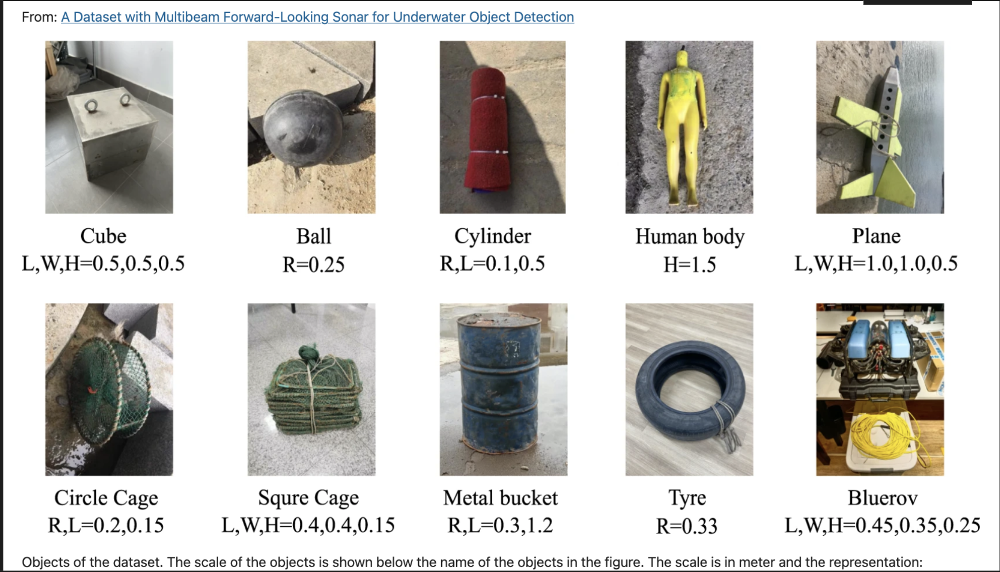
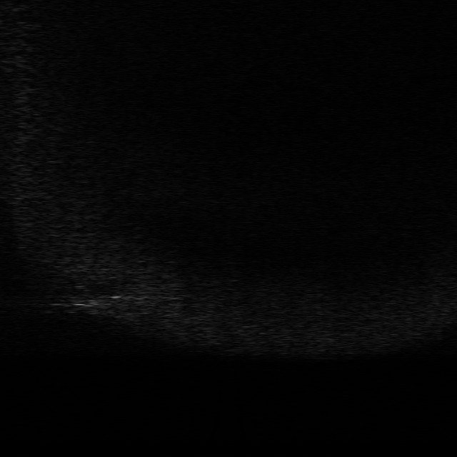
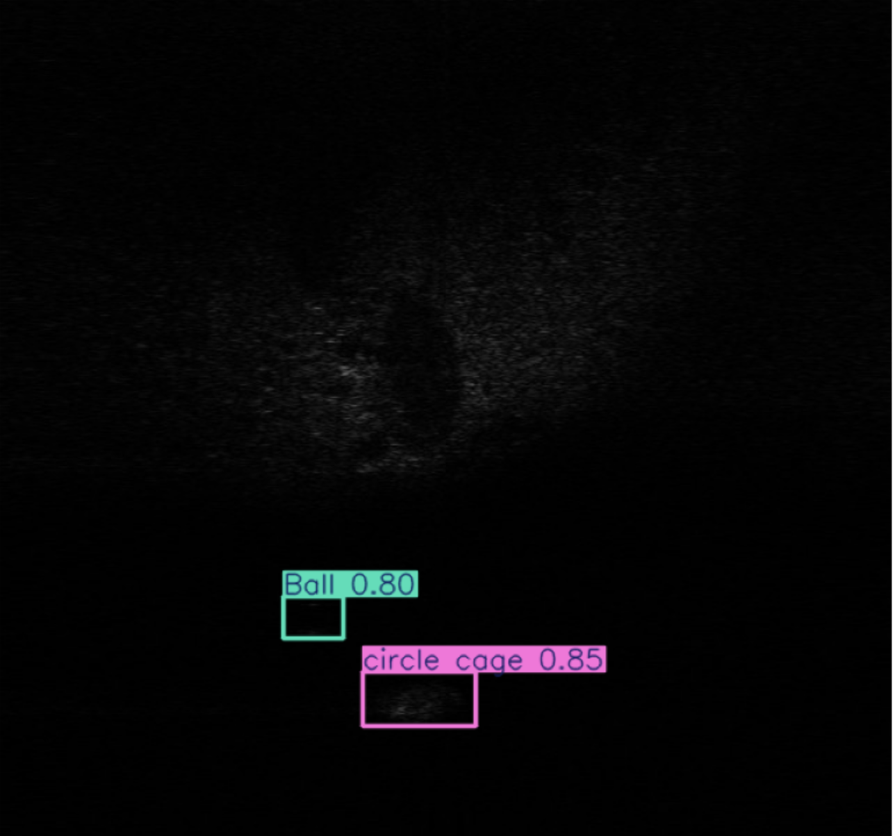
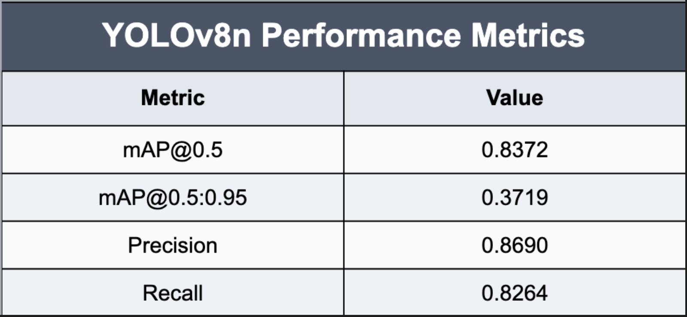

# Underwater Object Detection Website

A web application that detects underwater objects in sonar images using a deep learning model.

---

## 🌊 Relevance of the Project

Detecting objects in sonar images plays a crucial role in marine research and oceanology. Applications include:

- Mapping ocean floors for scientific exploration.
- Locating underwater wreckage and submerged infrastructure.
- Monitoring marine life and habitats.
- Supporting underwater navigation and robotics.

This AI-powered tool streamlines the detection process, enabling faster and more accurate analysis of sonar data.

---

## 🚀 Tech Stack

- **Frontend:** React (Vite)
- **Backend:** Node.js (JavaScript)
- **AI Model Server:** Flask (Python)
- **Model:** YOLOv8m (achieves ~83% mAP@0.5)

---

## 📸 Preview

### 1. Objects to be identified

### 2. Sample Sonar Image

### 3. Detected Results

### 4. Metrics

